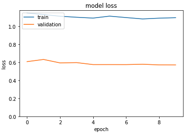
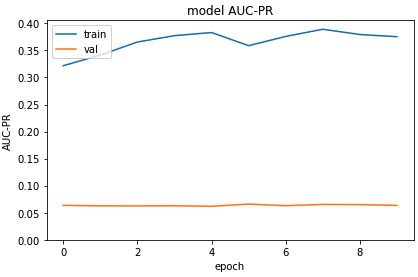

Emily Lorenzen

Metis Bootcamp - Deep Learning

Project Write-up

08/06/2021

# Drug mechanism of action determination by applying deep learning to images of cellular images. 

## Abstract
Drug development is both time and resource costly. Most clinical trials fail, costing companies hundreds of millions of dollars. Understanding the mechanism of action of a potential therapeutic reduces the chance of clinical trial failure. Currently, mechanism of action studies require the use of many different assays, which each require their own optimization. By applying deep learning to images of cells treated with various drugs, I am working toward developing a deep learning algorithm to determine MoA from a single assay. 

## Data 

Data were obtained from Image Data Resource (IDR) at https://idr.openmicroscopy.org/. All images were from study idr0088. In total, 25998 images were downloaded as pngs. Following image download, I scraped IDR to obtain the drug treatment corresponding to each image ID. Finally, I manually curated the MoA for each drug and merged the information to map the image ID to the MoA. In total, there were 31 MoAs.

## Tool and Algorithm

### Data acquisition and EDA 

In addition to pandas and seaborn the following python packages were used for data acquisition, cleanup, and EDA.

Omero, IDR, and requests were used to connect to IDR and retrieve images and information. 

### Data modeling

Keras and sklearn were used for CNN training and evaluation

Tensorboard was used to graph AUC and loss over as a function of epoch.

## Results

To simplify the problem, I decided to focus on predicting whether the cells were exposed to a GPCR agonist or not. I wanted to maximize the AUC with a precision recall curve (AUC-PR), since I am most interested in finding true positives (a GPCR agonist) while optimizing precision. Since the classes were unbalanced I included class_weights to equalize the classes. 

I ran the following models and calculated AUC-PR with  as a metric:
    - Initial attempt: 0.0657
    - Added a convolution layer: 0.0631
    - Added a dense layer: 0.0698
    - Changed activation function from relu to leaky relu: 0.0666

And the following transfer learning models with respective AUC-PR: 
    - MobilenetV2: 0.0733

I plotted loss (top graph) and AUC-PR (bottom graph) over each epoch for the transfer learning model. B

## Communication 

Results were presented on June 11, 2021 to colleagues in the Metis data science bootcamp. Code is available is at https://www.github.com/emilylorenzen/metis-deeplearning